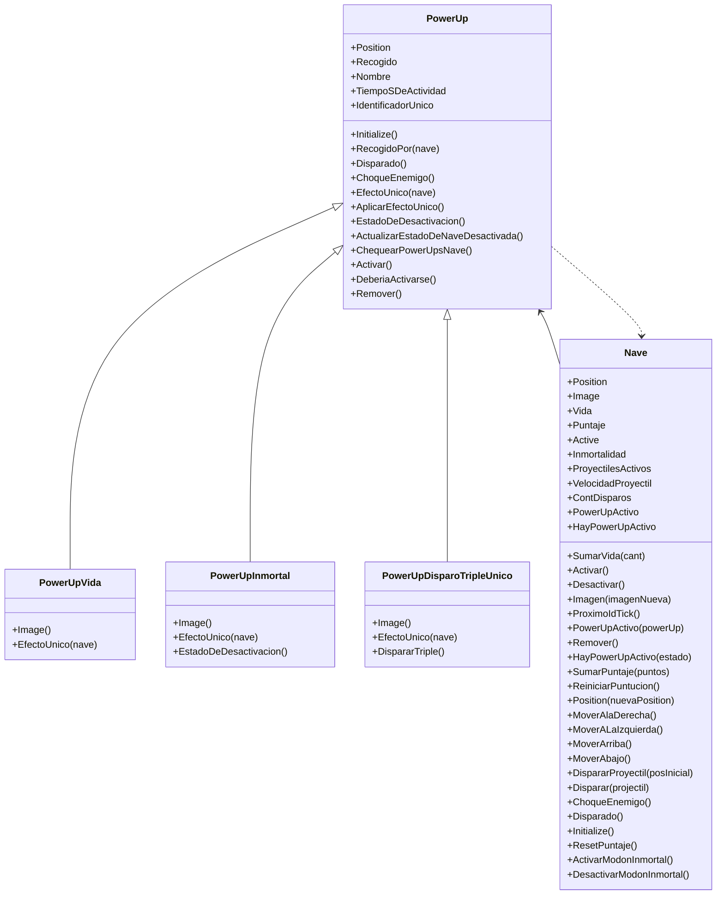

```mermaid
classDiagram
    class PowerUp {
        +Position
        +Recogido
        +Nombre
        +TiempoSDeActividad
        +IdentificadorUnico
        +Initialize()
        +RecogidoPor(nave)
        +Disparado()
        +ChoqueEnemigo()
        +EfectoUnico(nave)
        +AplicarEfectoUnico()
        +EstadoDeDesactivacion()
        +ActualizarEstadoDeNaveDesactivada()
        +ChequearPowerUpsNave()
        +Activar()
        +DeberiaActivarse()
        +Remover()
    }

    class PowerUpVida {
        +Image()
        +EfectoUnico(nave)
    }

    class PowerUpInmortal {
        +Image()
        +EfectoUnico(nave)
        +EstadoDeDesactivacion()
    }

    class PowerUpDisparoTripleUnico {
        +Image()
        +EfectoUnico(nave)
        +DispararTriple()
    }

    class Nave {
        +Position
        +Image
        +Vida
        +Puntaje
        +Active
        +Inmortalidad
        +ProyectilesActivos
        +VelocidadProyectil
        +ContDisparos
        +PowerUpActivo
        +HayPowerUpActivo
        +SumarVida(cant)
        +Activar()
        +Desactivar()
        +Imagen(imagenNueva)
        +ProximoIdTick()
        +PowerUpActivo(powerUp)
        +Remover()
        +HayPowerUpActivo(estado)
        +SumarPuntaje(puntos)
        +ReiniciarPuntucion()
        +Position(nuevaPosition)
        +MoverAlaDerecha()
        +MoverALaIzquierda()
        +MoverArriba()
        +MoverAbajo()
        +DispararProyectil(posInicial)
        +Disparar(projectil)
        +ChoqueEnemigo()
        +Disparado()
        +Initialize()
        +ResetPuntaje()
        +ActivarModonInmortal()
        +DesactivarModonInmortal()
    }

    PowerUp <|-- PowerUpVida
    PowerUp <|-- PowerUpInmortal
    PowerUp <|-- PowerUpDisparoTripleUnico
    PowerUp <-- Nave 
    Nave <.. PowerUp 
```