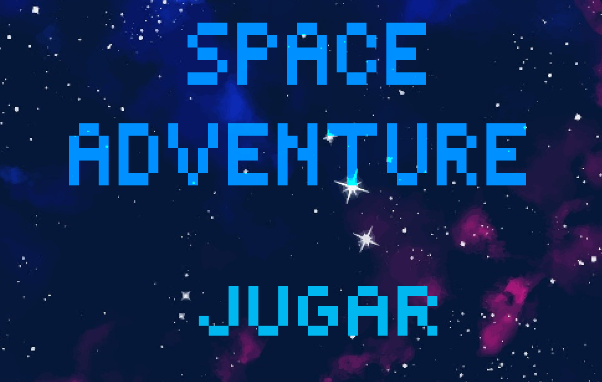
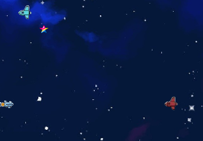

UTN - Facultad Regional Buenos Aires - Materia Paradigmas de Programación

## Equipo de desarrollo:

- Joaquin Bidart, Julieta Crignola, Tomas Cortes, y Matias Galarza 

## Introducción

- Space Aventure! Que mejor juego que uno simple, pero entretenido y con mecánicas interesantes. Una reversión de un formato clásico hecho en wollok

## Capturas

### Instrucciones del juego

- Disparar a las naves enemigas para que desaparezcan, cada tipo de nave tendrá distintos puntos de vida.
- Las naves dan puntos al ser eliminadas depedniedno de su tipo, mientras mas dificiles de destruir, más puntos.
- La dificultad aumenta a medida que se van ganando puntos, subiendo la probabilidad de spawnear naves más resistentes.
- Si una nave alcanza el final izquierdo de la pantalla, se quita un punto. 
- Al chocar con una nave enemiga, se pierde un punto de vida. Si se pierden todas las vidas … Game over

Existen distintos PowerUps:
- Vida Extra 
  
- Inmortalidad 
  
- Disparo triple 

### Controles:

- Con las flechas se puede mover la nave
- Con el espacio se dispara el proyectil

## Explicaciones teóricas y diagramas

- [Diagrama Estatico de Power Ups](DiagramaEstaticoPowerUps.md)

